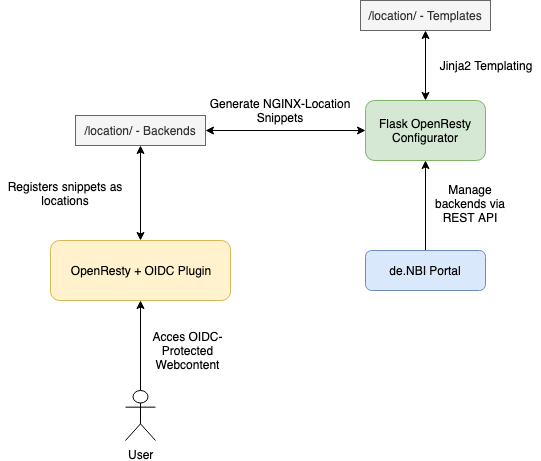

# Flask OpenResty Configurator

### Quick Introduction
The Flask OpenResty Configurator (FORC) is a simple dynamic reverse proxy configurator for the webserver [OpenResty](http://openresty.org/en/), decorated as 
an RESTFUL API. This service helps to dynamically create and protect reverse proxy locations. The target of this is, to provide customers a very simple access to various
"research-environments" via browser. Access to those environment are protected via [ELIXIR AAI](https://elixir-europe.org/services/compute/aai) and [OpenID Connect](https://openid.net/connect/).

### Structure


FORC works in combination with OpenResty and the de.NBI Portal. FORCs job is to generate configuration snippets in form of NGINX config files. It does this
by making use of the Jinja2 templating engine. 


### Requirements

Make sure that your Webserver has met the following requirements:

* Ubuntu 18.04 (other debian based may also work)
* [OpenResty](http://openresty.org/en/) with OPM installed
* [OIDC-Plugin](https://github.com/zmartzone/lua-resty-openidc) installed via OPM
* HaProxy
* Python3 with pip3
* SSL Cert and Key matching the Webserver URL. (Certbot, custom certs...)
* User running this Service needs rights to reload OpenResty.

### Quick Start

* Clone this repo.
* Install the required packages (preferable in an virtualenv) with `pip3 install -r FlaskOpenRestyConfigurator/requirements.txt`

Configure needed environment variables with `export VARIABLE=VALUE`:

| Variable        | Description           | Example  |
| ------------- |:-------------:| -----:|
| FORC_SECRET_KEY      | Encryption key for flask service | fnbds378hr4387fh34 |
| FORC_API_KEY      | X-Auth Key for accessing REST API      |   fn438hf37ffbn8 |
| FORC_BACKEND_PATH | Filesystem path in where FORC generates NGINX config snippets to      |    /home/ubuntu/backend_path/ |
| FORC_TEMPLATE_PATH | Filesystem path which locates template files for FORC | /home/ubuntu/template_path/ |

Afterwards, start the FORC Service with `python3 FlaskOpenRestyConfigurator/manage.py run`.
FORC runs on `127.0.0.1:5000` (configurable in future releases).

Currently, the engine running this service is the development backend engine from flask. It is recommended to run this service
via uWSGI. This is still work in progress. In order to encrypt communication to the service from external locations, put this service
behind a HAProxy with SSL-Termination.

Depending on your configuration, you can make a test call with:
```
curl -X GET "http://localhost:5000/backends/" -H "accept: application/json" -H "X-API-KEY: $APIKEY"
```

### Install and Configure OpenResty

See [this](examples/openresty_configuration.md) guide.


### Templating

See [this](examples/templating_guide.md) guide on how to create and place valid configs in FORC.

### REST Documentation

An internal Swagger documentation is available internally in the FORC Service by accessing following URL via browser: `http://localhost:5000/`.

### Ansible Role
An ansible role for setting up a whole FORC environment will follow soon...